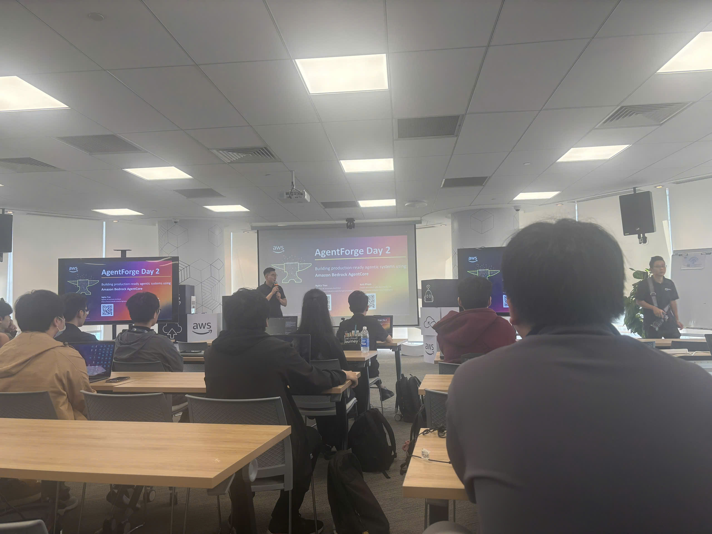

# Bài thu hoạch sự kiện “AWS FCAJ Agent Forge - Deep Dive Day 2”

### Thông Tin Chung
- **Tên sự kiện:** AWS FIRST CLOUD AI JOURNEY - AGENT FORGE DEEP DIVE.
- **Thời gian:** 09:00AM - 12:00PM, Thứ Bảy ngày 08/08/2026.
- **Địa điểm:** Tầng 26, Bitexco Financial Tower.
- **Diễn giả:** Anh Nghia Tran (Agentic SA) và Anh Pham (Cloud Consultant, G-AsiaPacific Vietnam).
- **Vai trò:** Người tham dự.

### Tổng Quan Sự Kiện
Sự kiện Agent Forge Deep Dive Day 2 tập trung đi sâu vào lý thuyết và thực hành việc xây dựng các hệ thống Agentic production-ready sử dụng Amazon Bedrock AgentCore. Chương trình được thiết kế bài bản, chia làm hai phần chính: lý thuyết về kiến trúc bộ nhớ cốt lõi (Memory, Evaluations, Observability) do anh Nghia Tran trình bày, và phần thực hành (Hands-on Lab) trực tiếp trên hệ thống do anh Anh Pham hướng dẫn.

### Nội Dung Chuyên Sâu

#### 1. Kiến trúc AgentCore Memory (Trình bày: Nghia Tran)
Hệ thống bộ nhớ của Agent được thiết kế chia làm hai luồng rõ rệt, kết nối thông qua Automatic Memory Extraction Module:
- **Short-term Memory (STM):** Bao gồm Chat Messages và Session State. Kiến trúc này đặc biệt hỗ trợ cơ chế Branching để tổ chức các luồng sự kiện nâng cao, rất hữu ích cho các kịch bản như chỉnh sửa tin nhắn hoặc rẽ nhánh hội thoại.
- **Long-term Memory (LTM):** Hỗ trợ đa dạng chiến lược lưu trữ, bao gồm:
  - *Summary:* Tạo ra các biểu diễn cô đọng về nội dung và kết quả tương tác.
  - *User Preferences:* Lưu trữ và học hỏi các mẫu lặp lại trong hành vi của người dùng.
  - *Semantic & Episodic:* Duy trì kiến thức đặc thù của lĩnh vực, đồng thời nắm bắt các quyết định để cải thiện hiệu suất Agent.

**Tối ưu hóa bằng Namespaces & Metadata:**
- Namespaces giúp nhóm và tổ chức bộ nhớ dài hạn một cách logic bằng định dạng phân cấp (vd: `/`), hỗ trợ các biến động như `{actorId}`, `{strategyId}`.
- Trong khi Namespaces dùng để cô lập đối tượng, Metadata xác định phạm vi bên trong namespace đó và cho phép cấu hình các khóa được lập chỉ mục (indexed Keys) để lọc trước (pre-filter) dữ liệu.

#### 2. Thực hành Hands-on Lab (Hướng dẫn: Anh Pham)
Phần thực hành được triển khai trực tiếp trên môi trường Lab của AWS, giúp người tham gia trực tiếp thao tác các công cụ:
- Thực hành cấu hình thêm bộ nhớ (Add memory) để cá nhân hóa hành vi của AI.
- Sử dụng AgentCore Evaluations để theo dõi, đánh giá hiệu suất.
- Khám phá tính năng Observability để theo dõi luồng xử lý và thao tác với các công cụ Harness trong hệ sinh thái AgentCore.

### Trải Nghiệm Và Kiến Thức Đạt Được

Sự kiện được tổ chức vô cùng chuyên nghiệp tại Bitexco. Các diễn giả truyền đạt kiến thức logic, kết hợp hoàn hảo giữa lý thuyết chuyên sâu và môi trường Lab thực tế, giúp học viên dễ dàng làm chủ các công nghệ Generative AI mới nhất. 

Khóa học đã cung cấp cho mình nền tảng vững chắc về cách thiết kế trí nhớ cho AI Agent hiện đại. Việc phân tách rõ ràng STM và LTM, kết hợp kỹ thuật phân vùng bằng Namespaces giúp tối ưu hóa khả năng duy trì ngữ cảnh của LLM mà không gây tốn kém token.

### Ứng Dụng Vào Dự Án Thực Tế (Cloud Finance Platform)

AWS FCAJ Agent Forge mở ra những góc nhìn mới mẻ để mình hoàn thiện hệ thống Quản lý tài chính cá nhân thông minh:
- **Tối ưu hóa trợ lý AI tài chính:** Áp dụng chiến lược LTM (*User Preferences*) để chatbot có thể tự động ghi nhớ và học hỏi các mẫu hành vi chi tiêu quen thuộc của từng người dùng.
- **Bảo mật và phân quyền dữ liệu NLP:** Ứng dụng cấu trúc *Namespaces* kết hợp các biến định danh (như `{actorId}`) để cô lập tuyệt đối dữ liệu lịch sử giao dịch và ngữ cảnh hội thoại cá nhân, đảm bảo an toàn thông tin mức cao nhất.

### Hình Ảnh Sự Kiện

