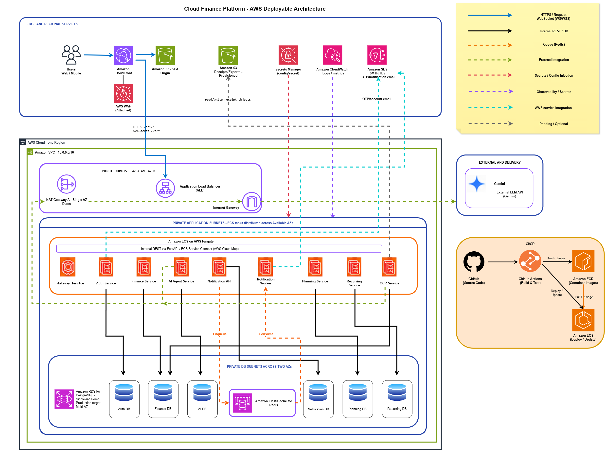

#### General Introduction

Welcome to the hands-on deployment guide for the **Cloud Finance Platform** – an intelligent personal finance management platform integrating Artificial Intelligence (AI/NLP) and Optical Character Recognition (OCR).

Based on standardized architectural blueprints, this workshop guides you step-by-step through configuring cloud infrastructure from scratch on the AWS Management Console, setting up secure networks, initializing data layers, containerizing workloads, running them on serverless ECS Fargate, and optimizing content delivery.

#### Overall Architecture Diagram

The system is structured across distinct tiers:
+ **Edge & Regional Services:** Amazon CloudFront integrated with AWS WAF for secure SPA distribution, alongside Amazon S3 for static assets and receipts storage.
+ **Compute Layer (ECS Fargate):** Operates 9 independent microservices (Gateway, Auth, Finance, AI Agent, Notification API, Notification Worker, Planning, Recurring, OCR) coordinated via an Application Load Balancer and AWS Cloud Map.
+ **Data & Cache Tier:** Amazon RDS PostgreSQL implementing the *Database-per-service* pattern and Amazon ElastiCache for Redis acting as an asynchronous message queue.
+ **Security & Integration Tier:** AWS Secrets Manager securely handles sensitive credentials, with direct integration to the Google Gemini API for natural language analytics.