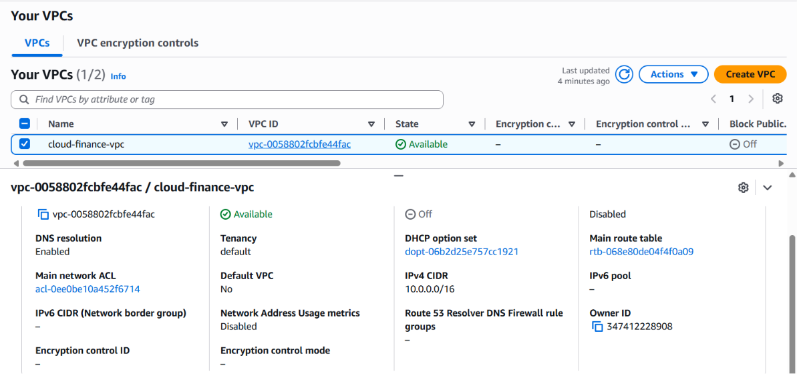
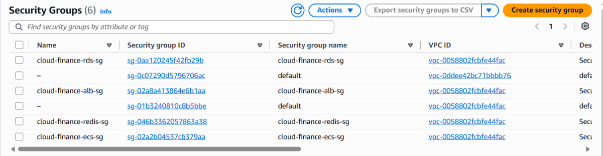

#### Mục tiêu
Xây dựng một mạng riêng ảo (VPC) khép kín, phân tách rõ ràng giữa vùng công cộng (**Public Subnet**) để đặt Load Balancer đón traffic từ Internet và vùng riêng tư (**Private Subnet**) nhằm bảo vệ an toàn tuyệt đối cho các container ứng dụng và cơ sở dữ liệu.

#### 1. Tạo Amazon VPC
1. Truy cập AWS Management Console, tìm kiếm và chọn dịch vụ **VPC**.
2. Chọn **VPC Dashboard** -> Bấm **Create VPC**.
3. Chọn cấu hình **VPC and more**.
4. Thiết lập các thông số cấu hình cơ bản:
   * **Name tag auto-generation:** `cloud-finance-vpc`
   * **IPv4 CIDR block:** `10.0.0.0/16`
   * **Tenancy:** `Default`
   * **Number of Availability Zones (AZs):** `2` (chọn các vùng như `ap-southeast-1a` và `ap-southeast-1b`)
   * **Number of public subnets:** `2`
   * **Number of private subnets:** `4` (chia làm 2 subnet cho ứng dụng ECS và 2 subnet cho Database)
   * **NAT gateways:** Chọn `1 NAT gateway` (đặt ở chế độ Single AZ để tối ưu chi phí demo)
   * **VPC endpoints:** Không chọn (sẽ cấu hình riêng nếu cần)
5. Bấm **Create VPC** và đợi hệ thống tự động khởi tạo hoàn tất hạ tầng mạng.

#### 2. Cấu hình Security Groups (Tường lửa mạng)
Chúng ta cần thiết lập 4 nhóm Security Groups để kiểm soát chặt chẽ luồng truy cập giữa các tầng:
+ `alb-sg` (Security Group cho Load Balancer): Cho phép inbound traffic cổng `80` (HTTP) và `443` (HTTPS) từ mọi nguồn (`0.0.0.0/0`).
+ `ecs-sg` (Security Group cho Microservices): Chỉ cho phép inbound traffic cổng `8000` xuất phát từ `alb-sg` và giao tiếp nội bộ giữa các service.
+ `rds-sg` (Security Group cho PostgreSQL): Chỉ cho phép inbound traffic cổng `5432` xuất phát từ `ecs-sg`. Tuyệt đối **không mở công khai** ra ngoài Internet.
+ `redis-sg` (Security Group cho ElastiCache Redis): Chỉ cho phép inbound traffic cổng `6379` xuất phát từ `ecs-sg` (đặc biệt phục vụ cho Notification Worker).

