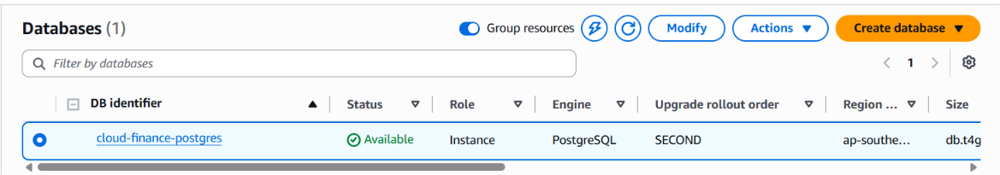
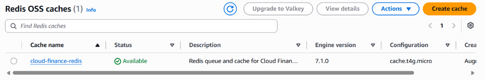
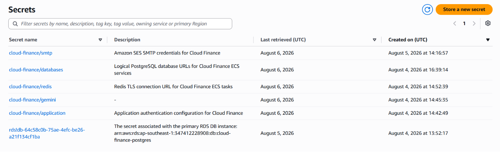

#### Mục tiêu
Khởi tạo cơ sở dữ liệu quan hệ Amazon RDS PostgreSQL theo mô hình *Database-per-service*, thiết lập bộ nhớ đệm ElastiCache Redis phục vụ hàng đợi bất đồng bộ, và quản lý toàn bộ thông tin nhạy cảm tập trung bằng AWS Secrets Manager.

#### 1. Tạo Amazon RDS PostgreSQL (Database-per-service Pattern)
1. Truy cập dịch vụ **RDS** trên AWS Console -> Bấm **Create database**.
2. Chọn **Standard create** và chọn engine **PostgreSQL**.
3. Ở mục **Templates**, chọn **Free tier** hoặc **Dev/Test** (chế độ Single-AZ để tiết kiệm chi phí demo).
4. Thiết lập thông số:
   * **DB instance identifier:** `cloud-finance-postgres`
   * **Master username:** `postgres`
   * **Master password:** Thiết lập mật khẩu mạnh
   * **Connectivity:** Chọn VPC `cloud-finance-vpc`, cấu hình **Public access** là `No` (bảo mật tuyệt đối trong Private Subnet), và gắn Security Group `rds-sg`.
5. Bấm **Create database**. Sau khi khởi tạo xong, tiến hành tạo các cơ sở dữ liệu logic độc lập tương ứng với các dịch vụ (`auth_db`, `finance_db`, `ai_db`, `notifications_db`, `planning_db`, `recurring_db`).

#### 2. Tạo Amazon ElastiCache for Redis
1. Vào dịch vụ **ElastiCache** -> Chọn **Redis caches** -> Bấm **Create Redis cluster**.
2. Cấu hình thông tin:
   * **Name:** `cloud-finance-redis`
   * **Node type:** `cache.t4g.micro`
   * **Number of replicas:** `0` (tối ưu cho môi trường demo)
   * **Subnet and VPC:** Chọn `cloud-finance-vpc` và gán Security Group `redis-sg`.
3. Bấm **Create**.

#### 3. Cấu hình AWS Secrets Manager
Thay vì lưu file `.env` thô trên server, toàn bộ thông tin cấu hình nhạy cảm được quản lý tập trung và an toàn tại đây:
1. Vào dịch vụ **Secrets Manager** -> Bấm **Store a new secret**.
2. Chọn **Other type of secret**, nhập các cặp Key/Value chứa đường dẫn kết nối cơ sở dữ liệu, khóa API Gemini và chuỗi JWT Secret.
3. Đặt tên secret là `cloud-finance/production-secrets` và hoàn tất quá trình tạo.

