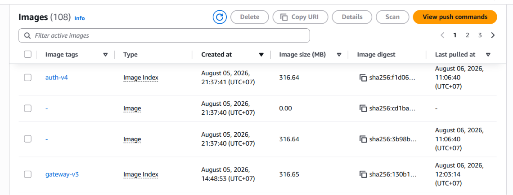

#### Objective
Containerize backend microservices into optimized Docker images and store them centrally within AWS's secure registry.

#### 1. Creating Amazon ECR Repositories
1. Access the **Amazon Elastic Container Registry (ECR)** service on the AWS Console.
2. Click **Create repository** and provision separate repositories for each microservice in the system:
   * `cloud-finance/gateway`
   * `cloud-finance/auth`
   * `cloud-finance/finance`
   * `cloud-finance/ai-agent`
   * `cloud-finance/notification-api`
   * `cloud-finance/notification-worker`
   * `cloud-finance/planning`
   * `cloud-finance/recurring`
   * `cloud-finance/ocr`



#### 2. Building and Pushing Docker Images (Example for Gateway Service)
Use your local terminal to build, tag, and push version `v3` images to ECR:

```bash
# Authenticate with AWS ECR
aws ecr get-login-password --region ap-southeast-1 | docker login --username AWS --password-stdin <your-account-id>.dkr.ecr.ap-southeast-1.amazonaws.com

# Build the Docker image version v3
docker build -t cloud-finance/gateway:v3 -f Dockerfile .

# Tag the image pointing to the ECR repository
docker tag cloud-finance/gateway:v3 <your-account-id>[.dkr.ecr.ap-southeast-1.amazonaws.com/cloud-finance/gateway:v3](https://.dkr.ecr.ap-southeast-1.amazonaws.com/cloud-finance/gateway:v3)

# Push the image to the ECR repository
docker push <your-account-id>[.dkr.ecr.ap-southeast-1.amazonaws.com/cloud-finance/gateway:v3](https://.dkr.ecr.ap-southeast-1.amazonaws.com/cloud-finance/gateway:v3)