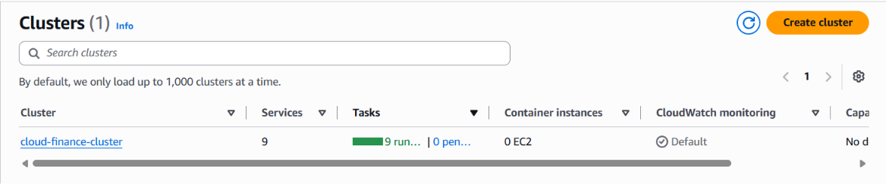
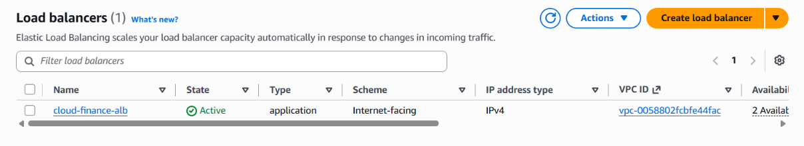
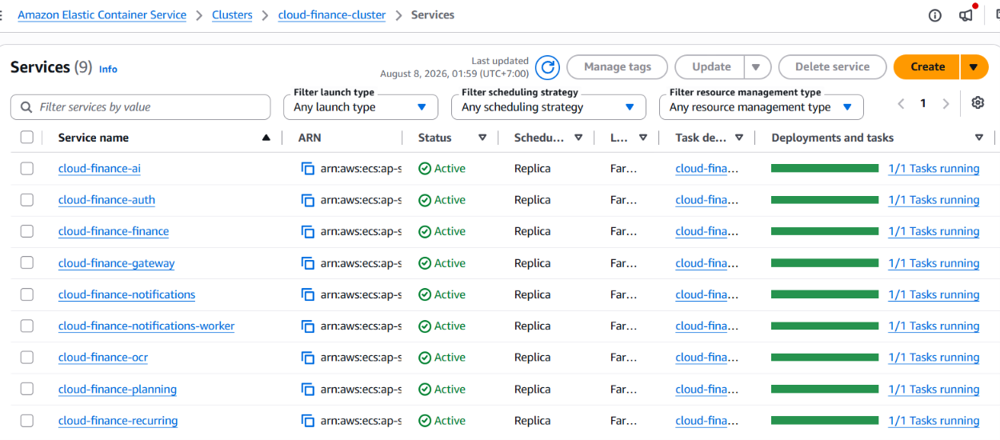

#### Mục tiêu
Khởi tạo cụm serverless ECS Cluster, cấu hình Application Load Balancer điều phối traffic, và thiết lập Task Definitions để vận hành các microservices kết hợp cơ chế lấy cấu hình bảo mật từ AWS Secrets Manager.

#### 1. Tạo Amazon ECS Cluster
1. Truy cập dịch vụ **Amazon ECS** trên AWS Console.
2. Chọn **Clusters** -> Bấm **Create cluster**.
3. Đặt tên cluster: `cloud-finance-cluster`.
4. Phần **Infrastructure**: Chọn **AWS Fargate** (serverless).
5. Bấm **Create**.

#### 2. Cấu hình Application Load Balancer (ALB)
1. Truy cập dịch vụ **EC2** -> Mục **Load Balancing** -> Chọn **Load Balancers** -> Bấm **Create Load Balancer**.
2. Chọn **Application Load Balancer**.
3. Cấu hình thông số:
   * **Name:** `cloud-finance-alb`
   * **Scheme:** `Internet-facing`
   * **VPC:** Chọn `cloud-finance-vpc` và 2 Public Subnets
   * **Security groups:** Chọn `alb-sg`
4. Tạo các Target Groups (ví dụ: `tg-gateway` với cổng `8000`, đường dẫn health check `/health`) và hoàn tất tạo ALB.

#### 3. Khởi tạo Task Definitions và ECS Services
1. Trong ECS Console, chọn **Task definitions** -> **Create new task definition**.
2. Đặt tên family (ví dụ: `cloud-finance-gateway-task`), chọn launch type là **AWS Fargate** với network mode là `awsvpc`.
3. Khai báo **Container Definitions**: trỏ tới image trên ECR, mở cổng `8000`, và cấu hình phần `secrets` để tự động kéo giá trị bảo mật từ AWS Secrets Manager vào biến môi trường lúc container khởi động.
4. Quay lại `cloud-finance-cluster`, bấm **Create Service** để khởi chạy dịch vụ, gắn vào ALB và kích hoạt tính năng **Service Connect** giúp các microservices giao tiếp nội bộ hiệu quả.

