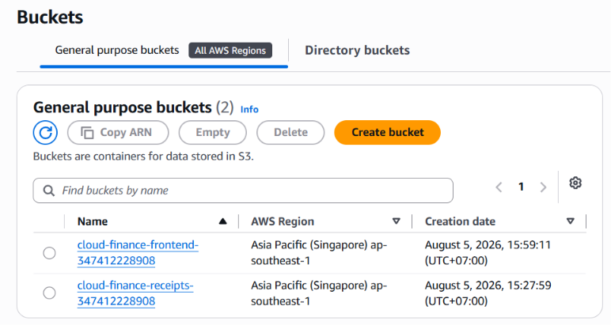
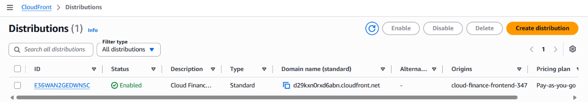

#### Mục tiêu
Lưu trữ mã nguồn giao diện Single Page Application (ReactJS) lên Amazon S3, sử dụng Amazon CloudFront để phân phối nội dung tĩnh tốc độ cao thông qua cơ chế bảo mật OAC, đồng thời tích hợp AWS WAF bảo vệ ứng dụng khỏi các cuộc tấn công.

#### 1. Cấu hình S3 Bucket cho Frontend
1. Truy cập dịch vụ **Amazon S3** trên AWS Console -> Bấm **Create bucket**.
2. Đặt tên bucket (ví dụ: `cloud-finance-frontend-<account-id>`) và bật chế độ **Block all public access** để đảm bảo bảo mật tuyệt đối.
3. Tiến hành build mã nguồn ReactJS trên máy cá nhân bằng lệnh `npm run build` và tải toàn bộ thư mục `dist` lên S3 bucket này.

#### 2. Cấu hình Amazon CloudFront Distribution
1. Truy cập dịch vụ **Amazon CloudFront** -> Bấm **Create distribution**.
2. **Origin domain:** Chọn S3 bucket chứa mã nguồn giao diện vừa tạo.
3. **Origin access:** Chọn **Origin access control (OAC)** và tạo một cấu hình OAC mới để CloudFront là kênh duy nhất có quyền truy cập trực tiếp vào S3.
4. **Behavior configuration:** 
   * Định cấu hình chuyển hướng request tĩnh về S3.
   * Thiết lập các request có tiền tố `/api/*` hoặc `/ws/*` được định tuyến chuyển tiếp thẳng về **Application Load Balancer (ALB)**.
5. Tích hợp **AWS WAF** vào phân phối CloudFront để lọc và ngăn chặn các hành vi độc hại.

